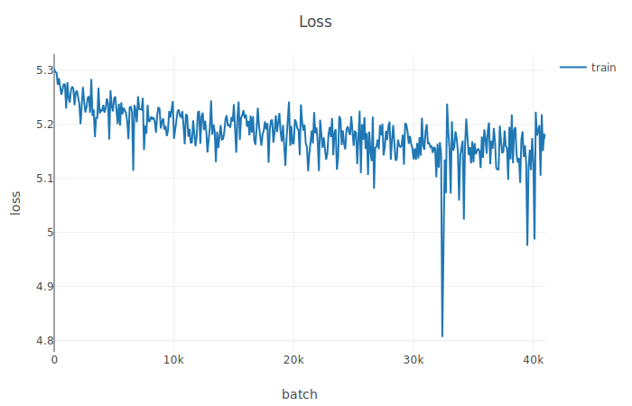
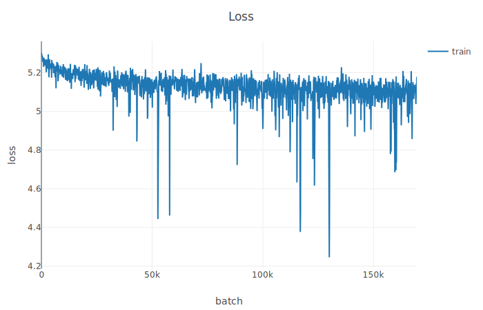
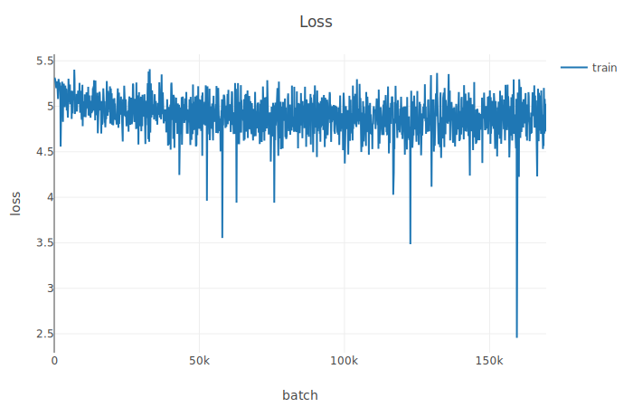

Log of my research experience, just for kicks. 
This is 95% complaints and 5% unintelligible.

### 04-28-19: 
---
Basically converted all the code to python3 for quick thoughts, but now I need to get the eval scripts set up.

Why are people using python2 in 2019?...

Got training working + training on GPU - saw a 40x speedup (thank god).

### 04-29-19:
---
And then I fucked up by running 
```
    chown -R jcaip /
```
by accident today... looks like when my system reboots I'll be screwed (and reinstall), but at least it's running fine right now.

JFC just trying to run this code is a PITA. looks like skip-thoughts, the original paper, needs to be cloned as well, but it uses freaking python2.7, so converting it here.

Honestly, I should probably just get this running with 2.7..... that's a bit of a bitter pill to swallow.

I just did it :(

### 05-05-19:
---
So some good progress today, finally got the dataset part working, and build a simple BOW max encoder. 

Now working on the model, actually seems to be going pretty well. 
Looks like I can just slap a softmax on top and do some shit, so no need to write it all myself. 

For now, just testing to see if I can get a full training script to run.

I got it working, but it looks like torchtext can't really handle the huge file well - so just going to use the simple approach and write some wrapper python. 

A little peeved, because i thought torchtext would handle this better - although tbf I'm probably not using it properly.
Actually, i could totally see it being an ease of use and not a speed thing, because writing this now is a pita.

I probably should have just split the file into multiple datasets, and then iterated through each set....

and then figure out a different way to build the vocab?

Finally some good news - got a basic testing script running, and it's able to handle all of BC.

even better news - I added in visdom...

now making progress on getting an lstm encoder, since it didn't look like the training was right.

- added in gradient clipping too, so today has been a nice day productivity wise.

maybe I should buy some more ram? looks like this whole thing uses just about 32 gigs.

But overall a bunch of good progress today.

CUDA working now too!

Really now i just need to focus on - some basic evaluation (nearest neighbors?)
and then speeding it up as much as possible

Came up with a realitvely shitty evaluation idea, but it was fast to implement. 

Basically i came up with 4 sentences with varying degree of simularity (sujbjectively), and then I'm just going to inspect the scores matrix manually. 

Also I can inspect the scores matrix for the data, now that I know what that looks like

Also added in checkpointing, so now this is running forreal for at least a night.... wonder what's going to

### 05-06-19:
---

OK it looks like visdom is a piece of shit that hangs - stopping the running script, so I took it out. Pretty disappointed in it.

^^ This actually might have been my fault, it's entirely possible I sent something over intmax as a loss.

Also my computer crashed overnight so doubly not visdom's fault

Took some time to refactor Now i got it all split up into a somewhat reasonable structure

figuered out the BCE loss thing was fucked, changed to softmax + KL divergence

- this was a big find, I'm glad I got that done

added back in visdom

So some good work, running a real experiment rn, and it looks promising so far.

I should really take a look at speeding up the dataset/dataloader. It definitely looks like I'm CPU bound atm - pegged at cpu, but on gpu utilization im seeing waiting periods.

Also pet peeve - I don't know what they did to the PyTorch documenation but now I'll hang for a bit before scrolling. TBH i just wish they kept the old documentation, as it was faster, even though I have to admit it does look slicker now. 

changed the Bookcorpus dataset so it is all in memory -> shouldn't be CPU bound hopefully.

for GPU: Seeing the same 3GB usage as described in the paper :+1: and pinned at 99% utilization

Getting this weird error only some of the time so idk but at least it's running now
```
Traceback (most recent call last):
  File "train.py", line 21, in <module>
    qt = QuickThoughts()
  File "/home/jcaip/workspace/quickthoughts/src/qt_model.py", line 29, in __init__
    self.enc_f = Encoder(wv_model).cuda()
  File "/home/jcaip/.conda/envs/ml/lib/python3.7/site-packages/torch/nn/modules/module.py", line 260, in cuda
    return self._apply(lambda t: t.cuda(device))
  File "/home/jcaip/.conda/envs/ml/lib/python3.7/site-packages/torch/nn/modules/module.py", line 187, in _apply
    module._apply(fn)
  File "/home/jcaip/.conda/envs/ml/lib/python3.7/site-packages/torch/nn/modules/module.py", line 193, in _apply
    param.data = fn(param.data)
  File "/home/jcaip/.conda/envs/ml/lib/python3.7/site-packages/torch/nn/modules/module.py", line 260, in <lambda>
    return self._apply(lambda t: t.cuda(device))
RuntimeError: CUDA out of memory. Tried to allocate 11.50 MiB (....)
```

looks like ~4minutes for 1000 batches -> approximtely 68 million / 400 * 4 minuts ~= 11 hours, which is what is descibed in the paper.

Ran into a problem with zero  lenght vectors, so i just added in a try catch/.

And then I got some weird 
```
bus error (core dumped)
```
Maybe want a way to resume training?

Basically my desktop is a little too jank to run right now, so I'm moving to cloud solutions - but that means I need to set up my laptop appropriately.

Ugh I hate this, wish I had a good setup already. Probably just going to wait for GCP.

In the meantime rerunning the code with hopes that it won't error out - if it does again I'm going to work on stateful training. So far the fathest I've gotten is 20k batches, a little more than 1/10 of the entire dataset.

I need to fix the rnn pack_padded_sequence, pad_packed_sequence bullshit. 

But in the meantime the script has . now hit just about 55k batches, which is great.

I guess applications for this are:
  semantic search? 

### 05-07-19:
----

A lot more progress today, I'm up and running on GCP. 

In short:
  - correctly implemented getting the last inputs
  - changed the collate_fn to a safe_one to handle zero length sequences
  - also wrote a preprocessing scrip to strip zero length seq out
  - can now pause/resume training as you please

So now I just need these runs to resolve, which will take some time. Then work on evaluating the resulting vectors.

### 05-08-19:
---

Switched to V100 GPU on GCP - need to make sure I'm not outliving my credits.

It looks like both of my training runs dies at ~70k iterations? So this may be a reproducable issue - I added in resume training so I may be able to test this. 

I had difficulty trying to ssh into the GCP instance - I had to restart it, and the run seemed to have hung.

So it looks like that'll be the primary thing I'll be trying to fix today.

I also got ahead of myself with rewriting the code. :( Refactor is completely broken.
I need a smaller dataset to test my scripts with

In the meantime here's a curve:




Looks like it died at 70k because I was writing to file too much and there was an error there.

```
RuntimeError: unable to write to file </torch_30135_3865702978>
Traceback (most recent call last):
  File "/opt/anaconda3/lib/python3.7/multiprocessing/queues.py", line 236, in _feed
    obj = _ForkingPickler.dumps(obj)
  File "/opt/anaconda3/lib/python3.7/multiprocessing/reduction.py", line 51, in dumps
    cls(buf, protocol).dump(obj)
  File "/opt/anaconda3/lib/python3.7/site-packages/torch/multiprocessing/reductions.py", line 315, in reduce_storage
    fd, size = storage._share_fd_()
```

On the bright side resume training is currently confirmed working :+1:. Should have a result soon.

Actually I keep on getting this problem -> so i thnk it's a problem with the data probably. 

Changed the data loader to just use 1 worker and it seems fine. 

I really need to split the dataset up into multiple files and handle it that way.

also visdom may not be the best logging solution -> can't start and stop over time.

### 05-09-19:
---
noticed that the norm threshold should be 5.0, so reran with that
Alright this is the last run:



So this training is not perfect, I really just need to focus on
- fixing the refactor and getting a release finished
- evaluate the resulting sentence vectors

Pausing GCP in the meantime - I might need more credits.

I think I'm good with the refactor actually - let's work on evaluation metrics?

Refactor is going well actually, now working on evaluation metrics - MR specifically. 

I ripped the code from here: https://github.com/ryankiros/skip-thoughts in order to do the classification. 

I need to handle this 0-sequence thing better, but I'm not sure how? 

Once i get this evaluation script running better I should convert to tensorboard and run with these metrics, but just taking it one day at a time. 

ugh this evaluation thing is such a PITA, I think i got a baseline working just now. 

Still it's an absolute pain to essentially port over code...

alright now its good tho, running a new run with 50k vocab size, and will test on that

In the meantime, the evaluation script needs to be cleaned up- which i did, and fixed whatever previous bug was there ( it wasn't 0 sequences )

I was concating tensors in the wrong dimension, so I fixed that as well. :+1:

Evaluation script finally working: end result? **60%** Accuracy on MR dataset :( so still need to try and figure out where stuff is going wrong, but overall a pretty productive day.

### 05-09-19:
---
So ran with 50k, heres a new loss curve, now no rolling average



And heres the MR classification results:
```
INFO     Found best C=  1 with accuracy: 61.18% in 192.30 seconds | Test Accuracy: 63.26%
INFO     Found best C=  1 with accuracy: 61.42% in 193.70 seconds | Test Accuracy: 62.98%
INFO     Found best C=  2 with accuracy: 61.70% in 193.55 seconds | Test Accuracy: 60.41%
INFO     Found best C=  1 with accuracy: 61.90% in 193.55 seconds | Test Accuracy: 59.47%
INFO     Found best C=  4 with accuracy: 61.53% in 193.62 seconds | Test Accuracy: 59.85%
INFO     Found best C=256 with accuracy: 61.14% in 191.16 seconds | Test Accuracy: 60.69%
INFO     Found best C=  1 with accuracy: 61.70% in 190.15 seconds | Test Accuracy: 63.70%
INFO     Found best C=128 with accuracy: 60.97% in 189.51 seconds | Test Accuracy: 62.57%
INFO     Found best C=  1 with accuracy: 60.85% in 187.81 seconds | Test Accuracy: 63.04%
INFO     Found best C=  1 with accuracy: 61.93% in 186.22 seconds | Test Accuracy: 60.51%
INFO     Finished Evaluation of MR | Accuracy: 0.6164857018767 | Total Time: 1919.0481956005096
```

Need to try bumping the hidden dimension (1000 -> 2400) and also Glove instead of word2vec vectors, but I think that's enough for right now


### 05-13-19:
---
So reviewing for the midterm, had a couple of ideas to improve this paper. 
Transformer encoder
scaling the softmax targets. (closer should be more related, further apart still related but less.) 
- this actually seems like a halfway decent idea now that I think about it.

I should set up tensorboardX stuff too, I need more information to make a better decision. 

Maybe I should also do the vocab expansion thing mentioned?

Alright GCP is ass, apparently there's no available resources at the time. 

So now I'm running a run with glove vectors and 2400 dim on my computer. 

### 05-14-19:

So unfortunately bumping up the hidden dim and changing the word vectors used makes this thing run a lot longer...

But on the bright side, changing it took almost no time at all.

One thing I would like to perhaps figure out a little bit better is to handle 0-length sequence better, without having to preprocess the text file a bunch of times. 

But ATM I'm just going to wait for this run to finish, and perhaps bring up GCP in the meantime, and make some workflow improvements.

Also worth noting for posterity's sake that i observe about 10% of batches have a 0-length sequence. This is suprisingly consistent, but i guess law of large numbers.

I feel like the biggest reason i left blend was because I didn't wanna fuck with AWS shit.... but that's pretty much what I"m doing right now.
Also maybe try elmo word vectors? but first focus on replicating the results. spinning up a new GCP instance now.
Okay, actuall GCP is so stupid. If I create a new conda env with GCP conda, it's a 2.7 env, even thought the conda python is 3.x 

Finally got off my ass and doing a proper run, replicating everything from the paper except using pretrained word embeddings (glove) and a 4 mil vocab instead of 20000. 

rewrote the eval script a little bit, not sure it made it better but I tihnk at least I understand it better now.

So i think my thing died on visdom again :(
  I should probably look to switching over to tensorboardX

### 05-15-19:
---
Rerunning new run, should have results soon.